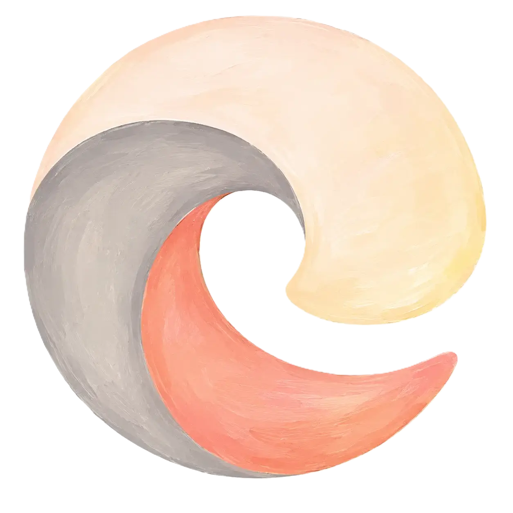

<p align="center">
  
</p>

<h1 align="center">DotsMap</h1>

<p align="center">
  拼豆图纸生成器 · Fuse Bead Pattern Generator · アイロンビーズ図案ジェネレーター<br/>
  Générateur de Perles à Repasser · Generador de Cuentas de Fusión · Генератор Схем для Термомозаики<br/>
  مولد أنماط الخرز الحراري · 퓨즈비즈 도안 생성기
</p>

<p align="center">
  <a href="https://github.com/langyo/dotsmap.langyo.xyz/actions/workflows/ci.yml"></a>
  [[](./LICENSE.txt)](./LICENSE.txt)<a href="https://dotsmap.langyo.xyz"></a>
  
</p>

<p align="center">
  <a href="docs/guides/en/README.md">English</a> ·
  <a href="docs/guides/zhs/README.md">简体中文</a> ·
  <a href="docs/guides/zht/README.md">繁體中文</a> ·
  <a href="docs/guides/ja/README.md">日本語</a><br/>
  <a href="docs/guides/ko/README.md">한국어</a> ·
  <a href="docs/guides/fr/README.md">Français</a> ·
  <a href="docs/guides/es/README.md">Español</a> ·
  <a href="docs/guides/ru/README.md">Русский</a>
</p>

---

## Features

- 11 bead brand color matching (MARD, COCO, Manman, Panpan, Mixiaowo, Perler, Hama, Artkal, Nabbi, Artkal-C, IKEA Pyssla)
- AI color quantization with background removal preprocessing
- Real-time preview with zoom/pan, hover crosshair + status overlay
- 5×5 grid subdivisions, color codes shown by default
- HD export for printing (256px/bead, with brand footer and swatches)
- Share image export (with DotsMap branding and QR code)
- SVG vector + CSV data file export
- IndexedDB state persistence (restore on refresh)
- Dark/light mode + 9 UI languages
- Mobile friendly (PWA support)

## Tech Stack

Vue 3 + TypeScript + TSX + Pinia + UnoCSS + Sass

## Development

```bash
pnpm install
pnpm dev
```

## 协议

基于 [合成源码协议（SySL）1.0 版](./LICENSE.txt) 授权。